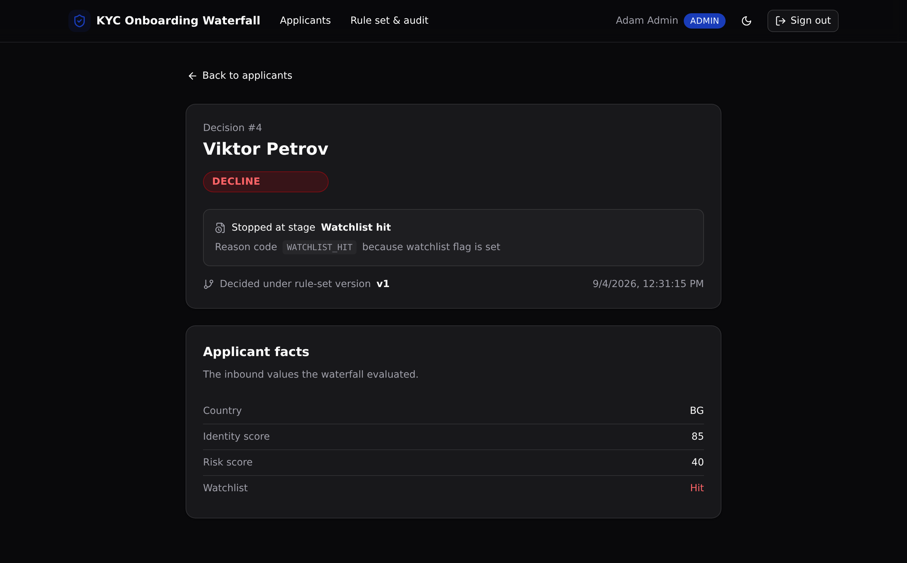

# KYC Onboarding Decision Waterfall

One governed, versioned KYC waterfall that every onboarding channel calls, so each applicant decides the same way and every decision is auditable.



**4 tables · 9 API endpoints · 3 RBAC roles** · native `@xanots/sdk` auth · no add-ons

## What it demonstrates

This is a **Business Logic Centralization** proof (Xano's Play 1) for **banking and financial crime**. Onboarding decision rules usually live copied across the account-opening app, partner channels, and back-office tools, each with its own thresholds. Here they live in one place: an ordered, versioned set of stages in the `rule_stages` table.

An applicant runs top to bottom through the stages. The first stage that fires stops the waterfall and decides the outcome. The decision records the exact stage that fired, its reason code, and the rule-set version, so a financial-crime team can point at any onboarding decision and show why it landed where it did.

Change a threshold and the version increments. Re-run the same applicant and the decision can move, with both the old and new decisions kept on the audit trail. That is the "define once, version it, audit it" story made concrete.

The evaluator this is built for is a bank's financial-crime engineering lead, accountable for defensible, auditable onboarding decisions.

## The one governed job

`POST /api:kyc/applicants/{id}/run` loads the active stages in order, evaluates each against the applicant's facts, and stops at the first stage that fires:

1. **Watchlist hit** (most severe, checked first). A watchlist flag declines outright.
2. **Risk score high.** A risk score at or above the threshold refers.
3. **Identity match low.** An identity score at or below the threshold refers.
4. **No stage fired.** The applicant is approved.

The stage's `check_type` names which applicant fact to read, and its `operator` and `threshold` decide whether it fires. The result is one `decisions` row with the outcome, the firing stage, the reason code, and the version.

## Repo layout

```
xano/
├── index.ts                 the workspace, registering everything
├── tables/
│   ├── users.ts             auth table + role (viewer / analyst / admin)
│   ├── rule-stages.ts       the ordered, versioned rule set
│   ├── applicants.ts        the inbound facts a stage evaluates
│   └── decisions.ts         the audit record, one row per run
└── api/
    ├── kyc.ts               the API group (pinned canonical slug)
    ├── seed.ts              idempotent demo bootstrap
    ├── login.ts             email + password to a token
    ├── applicants-*.ts      list, submit, run the waterfall
    ├── decision-get.ts      one decision joined to applicant + firing stage
    ├── decisions-list.ts    the audit trail
    └── stages-*.ts          list, edit (bumps the version)
frontend/                    React + Vite + Tailwind v4 + shadcn/ui
└── src/lib/api.ts           the one contract: paths + types from the defs
```

## API surface

| Method | Path | What it enforces |
| --- | --- | --- |
| `POST` | `/api:kyc/seed` | Public. Resets and seeds users, a v1 rule set, and four sample applicants. |
| `POST` | `/api:kyc/auth/login` | Public. Email and password against the auth table, returns a token. |
| `GET` | `/api:kyc/applicants/list` | Any signed-in role. |
| `POST` | `/api:kyc/applicants` | Analyst or admin. Validates the scores before storing. |
| `POST` | `/api:kyc/applicants/{id}/run` | Analyst or admin. Runs the waterfall, records a decision. |
| `GET` | `/api:kyc/decisions/{id}` | Any role. Joins the applicant and the firing stage. |
| `GET` | `/api:kyc/decisions` | Any role. The audit trail, newest first. |
| `GET` | `/api:kyc/stages` | Any role. The ordered rule set with versions. |
| `PUT` | `/api:kyc/stages/{id}` | Admin only. Edits a stage and bumps the version. |

Access is enforced at the API layer. Each protected endpoint reads the caller's role from their own row and gates on it. This is middleware-style RBAC, not row-level security.

## Quick start

Go from clone to a live backend in about a minute.

```bash
git clone https://github.com/xano-scratch/kyc-onboarding-waterfall.git
cd kyc-onboarding-waterfall
npm install
npx xanots login        # one-time browser sign-in with Xano
npm run xano:deploy     # builds the frontend, deploys both, prints the live URL
```

Then load the demo data and sign in:

1. `POST` the `/api:kyc/seed` endpoint once (the sign-in screen has a "Load demo data" button that does this for you).
2. Sign in as viewer, analyst, or admin. All three demo accounts share the password `kyc-demo-1234`.

To see the core demo: sign in as the analyst and run an applicant, then sign in as the admin, raise the identity stage threshold, and re-run the same applicant. The decision moves and the version bumps, with both decisions on the audit trail.

## FAQ

**Is auth row-level security?** No. Xano enforces access at the API layer with role checks in each endpoint. There is no row-level security here, and the app never claims any.

**Where does the "version" come from?** The current rule-set version is the highest version any active stage holds. Editing a stage sets it one past that, so the change is versioned and a re-run records the new version.

**Does it need external services?** No. It runs entirely on seeded data with no external credentials.

**Is this a production reference?** No. It is an internal proof artifact that shows the pattern. Treat it as a starting point, not a live customer system.

## Stack

Xano backend authored in TypeScript with [`@xanots/sdk`](https://www.npmjs.com/package/@xanots/sdk), plus a React + Vite + Tailwind v4 + shadcn/ui frontend that derives every request path and type from the backend defs. Type-checks with `tsc`, builds with Vite, and deploys live with `xanots deploy`.
